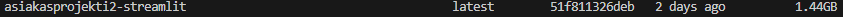
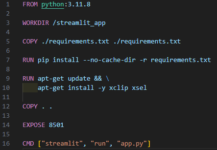
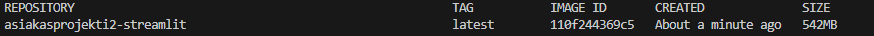
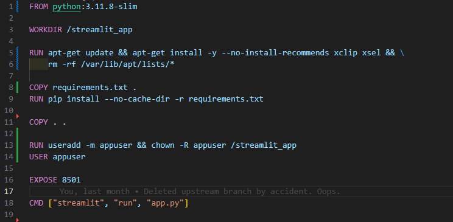
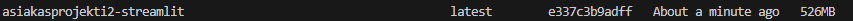
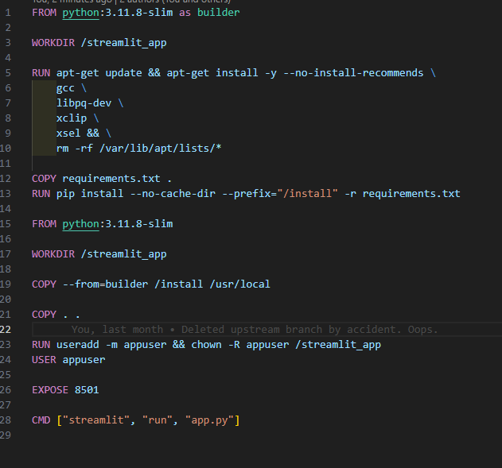

I'm going to be optimizing my streamlit frontend, since now I see that there is a LOT of optimization there.

# Current:

A whopping 1.44Gb, this is what it looks like: 

# After: 

Changes:
- using smaller base image
- remove apt lists after installing
- doesnt run as root anymore

With just these changes it decreased by 900Mb!! God damn.

I tried it with a multi-stage build just for fun, and got this:

Decreased only by 15Mb, which is to be expected of python. I can't use alpine since I have dependencies that don't exist on it.

