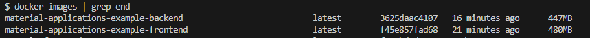
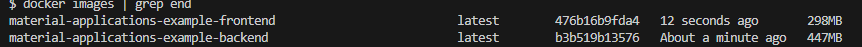

Before:

After combining layers and deleting not needed packages:

Deleting node modules reduced the size of the frontend a lot, but deleting temp files from the backend didn't really do anything.
